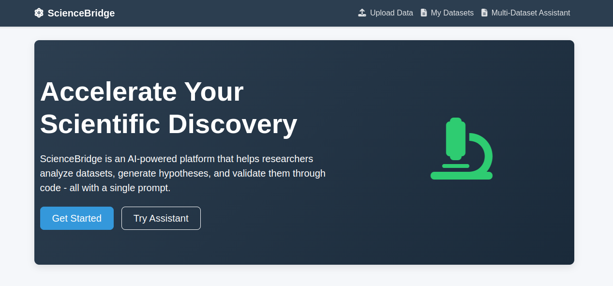
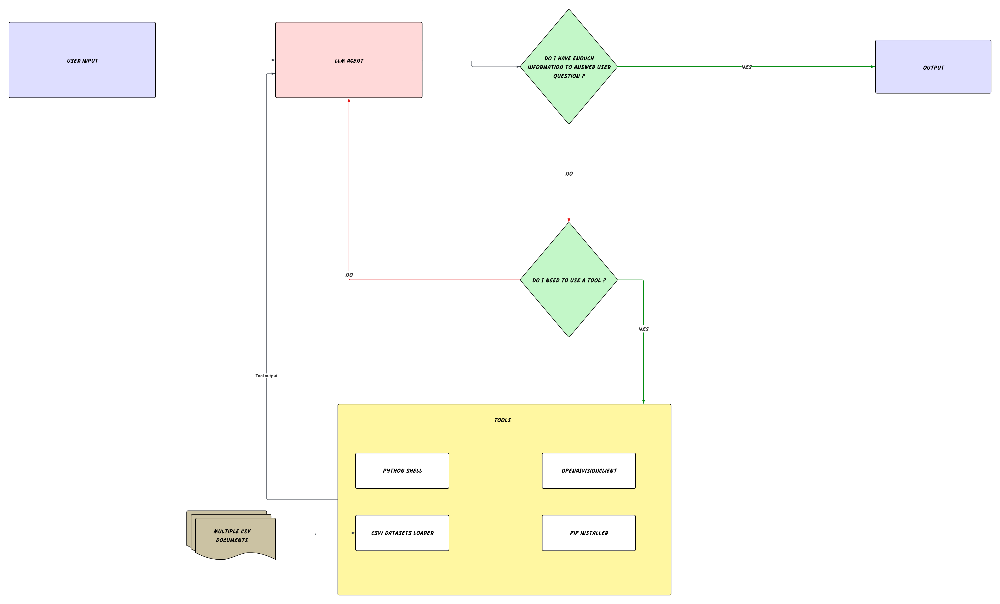

# ScienceBridge

ScienceBridge is an AI agent that accelerates scientific research by autonomously analyzing datasets, evaluating hypotheses, and validating them through code with a single prompt.



## System Design



## 🚀 Features

- **Autonomous Data Analysis**: Quickly analyze complex datasets without extensive coding
- **Hypothesis Generation**: Generate testable scientific hypotheses based on data patterns
- **Code Validation**: Validate hypotheses through automatically generated code
- **Visualization**: Generate insightful graphs and plots from your data
- **ML Integration**: Run simple ML models including:
  - Regression analysis
  - Decision tree classifiers
  - Clustering algorithms
  - Random forest models

## 📋 Quick Start

```bash
# Pull the Docker image
docker pull zaibaki/science-bridge:latest

# Run the container
docker run -p 8000:8000 --env-file .env zaibaki/science-bridge
```

The API will be accessible at http://localhost:8000

## 📚 Documentation

For detailed setup instructions, environment variables, development guidelines, and deployment options, please see the [Documentation](READMEDOCS.md) .

## 🔗 Resources

- Docker Hub: [https://hub.docker.com/repository/docker/zaibaki/science-bridge/](https://hub.docker.com/repository/docker/zaibaki/science-bridge/)
- GitHub Repository: [https://github.com/RichardKaranuMbuti/ScienceBridge](https://github.com/RichardKaranuMbuti/ScienceBridge)

## 🧪 Example Use Cases

- Quickly analyze experimental results
- Identify patterns in research data
- Generate and test hypotheses across multiple datasets
- Create publication-ready visualizations
- Perform preliminary machine learning analysis

## 📝 License

[MIT License](LICENSE)
